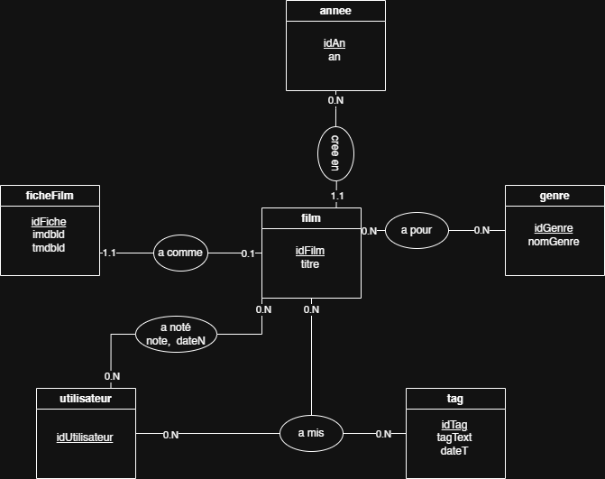

# WIKIFILM - ton wikipedia de film

## Description du projet

Ce projet est réalisé dans le cadre du module Programmation Web, dans le cadre de notre formation d'ingénieur informatique à Sup Galilée.

Il s'agit d'un site web qui permet la visualisation des données officielles sur des films (voir la section base de données pour plus de détail).

L'énoncé du projet est le suivant : https://github.com/samiryoucef/PDO1

Notre site répond aux besoins suivants :
- afficher la liste des films disponibles dans notre base de données
- rechercher un film par son nom
- filtrer les films selon le genre et les notes (croissante ou décroissante)
- afficher les détails d'un film (réalisateur, durée, note, année, description, commentaire)

## Installation et lancement du projet en local

### Prérequis
- XAMPP installé
- Git installé

### Étapes

1. Cloner le dépôt dans le dossier `htdocs` de XAMPP :
```bash
git clone https://github.com/cynhlfn/projetSAE.git
```

2. Copier le fichier de configuration de la base de données :
```bash
cp config/database.example.php config/database.php
```
Remplir les identifiants de connexion Railway fournis par l'équipe.

3. Créer le fichier de configuration TMDB :
```bash
cp config/tmdb.example.php config/tmdb.php
```
Remplir avec votre propre clé API TMDB (gratuite sur https://www.themoviedb.org/).

4. Démarrer XAMPP (Apache + MySQL).

5. Accéder au site sur :
```
http://localhost/projetSAE/index.php
```

## Accès au site web sans installation en local

Vous pouvez accéder au site directement à partir de ce lien :

[WikiFilm](https://projetsae-production.up.railway.app/index.php)

Aucun clone ou installation n'est exigé.

## Explication des choix techniques

### Technologies utilisées

- PHP
- JavaScript
- HTML
- CSS / Bootstrap
- MySQL
- Railway pour le déploiement
  

### Arborescence du projet

```text
├── config
│   ├── database.example.php
│   ├── database.php
│   └── tmdb.php
├── EXPLICATION.md
├── film.php
├── images
│   └── MEA.png
├── import
│   ├── datasetCSV
│   │   ├── links.csv
│   │   ├── movies.csv
│   │   ├── ratings.csv
│   │   ├── README.txt
│   │   └── tags.csv
│   ├── import_all.php
│   └── import_tags.php
├── index.php
├── nixpacks.toml
├── Procfile
├── public
│   ├── css
│   │   └── style.css
│   └── js
│       └── main.js
├── railway.toml
├── README.md
└── sql
    └── schema.sql
```

### Base de données

Nous utilisons des données recueillies sur le site https://grouplens.org/datasets/movielens/, qui regroupe plusieurs datasets, dont celui que nous utilisons dans ce projet.

Notre dataset est celui regroupant les données des films de MovieLens, dans sa version recommandée pour les projets réalisés dans un cadre éducatif (`ml-latest-small.zip`).

**Propriétés :**
- Taille : 1 Mo
- Films : 9000
- Utilisateurs : 600

**Fichiers contenus :**

`movies.csv` :
- `movieId` (exemple : 1)
- `title` (exemple : Toy Story (1995))
- `genre` (exemple : Adventure|Animation|Children|Comedy|Fantasy)

`tags.csv` :
- `userId` (exemple : 2)
- `movieId` (exemple : 60756)
- `tag` (exemple : funny) — un tag (petit texte) qu'un utilisateur va associer à un film
- `timestamp` (exemple : 1445714994) — ici, temps en secondes depuis le 1/1/1970

`ratings.csv` :
- `userId` (exemple : 1)
- `movieId` (exemple : 1)
- `rating` (exemple : 4.0)
- `timestamp` (exemple : 964982703) — ici, temps en secondes depuis le 1/1/1970

`links.csv` :
- `movieId` (exemple : 1)
- `imdbId` (exemple : 0114709) — afin de lier vers IMDB (imdb.com/title/tt0114709)
- `tmdbId` (exemple : 862) — afin de lier vers TheMovieDB (themoviedb.org/movie/862)

Grâce à ces deux derniers identifiants, nous pouvons récupérer des données supplémentaires comme les affiches de films.

Nous avons ensuite réfléchi à un modèle entité-association pour notre site, qui nous a aidés à correctement organiser les données fournies par le dataset.

Voici le modèle conceptuel des données de notre base de données :



- Nous avons fait le choix de créer une table séparée pour les années, afin d'éviter de stocker une même année plusieurs fois (si 50 films sont sortis en 1998, on n'aura pas l'année stockée 50 fois, mais une seule fois dans la table `annees`).
- Un modèle relationnel est conçu avant la création de la base de données. Une normalisation a ainsi été faite en vérifiant toutes les formes normales, avant d'écrire les requêtes SQL de création et de réponse aux besoins que notre site présente.


### Fonctionnalités

- Afficher la liste des films
- Rechercher un film
- Filtrer selon les genres / les notes
- Afficher les détails d'un film
- Récupérer les informations manquantes (description, durée, réalisateur, photo du film) via l'API de TMDB, l'identifiant TMDB étant présent dans notre base de données


### Déploiement

- Afin de remédier au problème de base de données locale (sur phpMyAdmin), que chaque membre du groupe devait créer de son côté, et dont les modifications restaient locales donc non partagées, nous avons décidé de déployer la base de données sur [Railway](https://railway.com/).
- Nous avons aussi déployé l'application sur Railway.
- Notre travail est en CD (Continuous Deployment), ce qui fait qu'à chaque push sur la branche `main`, le projet se déploie automatiquement.
- Nous suivons le déploiement sur Railway.
- Ainsi, vous pouvez voir et consulter notre site directement sur le lien :

[WikiFilm](https://projetsae-production.up.railway.app/index.php)


## Amélioration possible

- Ajouter un système d'authentification pour permettre aux utilisateurs de noter et taguer les films
- Permettre la recherche par réalisateur ou par acteur via l'API TMDB
- Ajouter un système de recommandation de films
- Optimiser les requêtes SQL pour que le site prenne moins de temps au chargement
- Utiliser une base NoSQL (par exemple pour les tags ou les commentaires, plus flexibles qu'en relationnel)
- Mettre en cache les réponses de l'API TMDB pour réduire le nombre d'appels externes


## Auteurs

- Cyndia HALFOUN
- Hassina LOUNNACI
- Adrien YIGITKURT